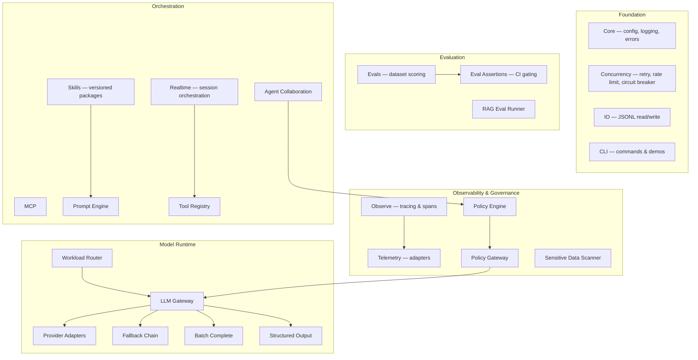

<p align="center">
  
</p>

# ElectriPy AI

**The Open Source AI Application Runtime.**

Everything required between prototype and production.

[](https://www.python.org/downloads/)
[](https://opensource.org/licenses/MIT)
[](https://github.com/inference-stack-llc/electripy-ai/actions/workflows/ci.yml)
[](https://pypi.org/project/electripy-ai/)
[](#status)
[](https://opensource.org/licenses/MIT)

---

## What is ElectriPy AI?

ElectriPy AI is the open source AI Application Runtime for building reliable, observable, governable, and evaluable production AI systems.

Most AI frameworks help you build agents, workflows, RAG pipelines, and tool integrations.

ElectriPy AI provides the runtime infrastructure those systems need once they touch production: reliability primitives, OpenTelemetry-aware observability, policy enforcement, evaluation pipelines, routing, MCP integration, reusable skills, and provider-neutral execution.

## Why ElectriPy AI Exists

AI prototypes are easy to demo and hard to operate.

Once AI systems reach production, teams need:

- tracing
- redaction
- policy enforcement
- approvals
- audit trails
- evaluation
- retries
- circuit breakers
- fallback routing
- provider abstraction
- session replay
- tool health visibility
- runtime controls

ElectriPy AI exists to make those capabilities composable and open source.

## Not Another Framework

ElectriPy AI is not an agent framework.  
ElectriPy AI is not a RAG framework.  
ElectriPy AI is not an MCP wrapper.  
ElectriPy AI is not a chatbot toolkit.

It is the runtime layer underneath production AI applications.

Use it with LangChain, LangGraph, LlamaIndex, AutoGen, CrewAI, Semantic Kernel, custom agents, or your own architecture.

---

## Installation

```bash
pip install electripy-ai
```

> **Package rename in progress.** Current builds may still be published under the previous package name during migration. The Python import namespace remains `electripy` in all cases.

```python
from electripy import Config, get_logger
from electripy.ai.policy_gateway import PolicyGateway
from electripy.concurrency import CircuitBreaker
```

### Verify

```bash
electripy doctor
```

---

## Quickstart

### Policy-governed LLM call

```python
from electripy.ai.policy_gateway import PolicyGateway, PolicyRule, PolicyStage, PolicyAction

gateway = PolicyGateway(rules=[
    PolicyRule(
        rule_id="pii-email",
        code="PII_EMAIL",
        description="Mask emails in prompts",
        stage=PolicyStage.PREFLIGHT,
        pattern=r"[A-Za-z0-9._%+-]+@[A-Za-z0-9.-]+",
        action=PolicyAction.SANITIZE,
    ),
])
```

### Circuit breaker

```python
from electripy.concurrency import CircuitBreaker

breaker = CircuitBreaker(failure_threshold=5, recovery_timeout=30.0)

@breaker
def call_provider():
    return client.complete(prompt)
```

### Evaluation in CI

```python
from electripy.ai.eval_assertions import assert_llm_output

assert_llm_output(
    "The capital of France is Paris.",
    contains=["Paris"],
    min_length=10,
)
```

### Realtime session

```python
from electripy.ai.realtime import RealtimeSessionService, RealtimeConfig, OutputStreamChunk

svc = RealtimeSessionService()
session = svc.create_session(config=RealtimeConfig(model="gpt-4o"))
svc.start_session(session.session_id)
svc.emit_output(session.session_id, OutputStreamChunk(index=0, text="Hello"))
svc.complete_session(session.session_id)
```

### Demo: Policy + Agent Collaboration

```bash
electripy demo policy-collab
```

See [recipes/03_policy_collaboration/](https://github.com/inference-stack-llc/electripy-ai/tree/main/recipes/03_policy_collaboration/) for the full runnable script.

---

## LSAS Architecture

LSAS Architecture is the layered systems architecture behind ElectriPy AI.

LSAS (Layered Systems Architecture for AI Systems) defines where production AI concerns belong. ElectriPy AI implements runtime primitives for those layers.

| Layer | Name | Production concern |
|-------|------|--------------------|
| 09 | Application | Business logic, UX, product surface |
| 08 | Orchestration | Agent routing, session flow, multi-agent handoffs |
| 07 | Memory | Conversation history, context window management |
| 06 | Knowledge | Retrieval, RAG, document indexing |
| 05 | Tool Integration | MCP, function calls, tool registry |
| 04 | Model Runtime | LLM gateway, provider adapters, structured output, caching |
| 03 | Reliability | Circuit breakers, retries, fallbacks, rate limiting |
| 02 | Observability | Tracing, spans, telemetry, redaction, cost metadata |
| 01 | Governance | Policy engine, policy gateway, approvals, audit trails |

See [docs/lsas.md](docs/lsas.md) for the full LSAS reference and [docs/architecture.md](docs/architecture.md) for how ElectriPy AI maps to each layer.

---

## Runtime Domains

ElectriPy AI is organized around production runtime concerns, not framework abstractions.

### Reliability

| Component | Purpose |
|-----------|---------|
| Circuit breaker | Stop cascading failures before they propagate |
| Retry (sync/async) | Configurable backoff with exception scoping |
| Fallback chain | Ranked provider failover with metadata tracking |
| Rate limiter | Token bucket algorithm, async-native |

### Observability

| Component | Purpose |
|-----------|---------|
| `observe` | OpenTelemetry-aligned structured tracing with AI-specific span kinds (LLM, agent, tool, retrieval, policy, MCP) |
| `telemetry` | Provider-agnostic telemetry adapters (JSONL, OpenTelemetry) for HTTP, LLM, policy, and RAG events |
| Sensitive data scanner | PII and secret redaction with 9+ built-in patterns |
| Cost ledger | Thread-safe token cost accumulation with multi-label slicing |
| Prompt fingerprint | Deterministic SHA-256 request hashing for caching, dedup, and drift detection |

### Governance

| Component | Purpose |
|-----------|---------|
| Policy engine | Subject/resource/action rules, approval workflows, evidence requirements, escalation chains |
| Policy gateway | Deterministic request/response guardrails with regex-based detection and multi-stage enforcement |
| Audit trails | Decision logging built into policy decisions |

### Evaluation

| Component | Purpose |
|-----------|---------|
| `evals` | Dataset-driven scoring with baseline comparison and CI-friendly reporting |
| `eval_assertions` | Pytest-native assertion helpers (keyword, regex, JSON schema, predicate, length) |
| RAG eval runner | Retrieval benchmarking with precision/recall/MRR metrics and drift detection |

### Orchestration

| Component | Purpose |
|-----------|---------|
| Workload router | Policy-driven, cost/latency/capability-aware model selection |
| Realtime | Session lifecycle with event sequencing, tool-call dispatch, interruption, backpressure |
| MCP | Strongly typed Model Context Protocol clients, servers, and tool adapters |
| Skills | Versioned, validated skill packages with manifest-driven composition |
| Agent collaboration | Bounded multi-agent handoff orchestration with hop limits and policy integration |

### Model Runtime

| Component | Purpose |
|-----------|---------|
| LLM gateway | Provider-agnostic sync/async LLM clients with request/response hooks |
| Provider adapters | OpenAI, Anthropic, Ollama, and generic HTTP-JSON adapters |
| Structured output | Pydantic extraction from LLM text with auto-retry and temperature decay |
| LLM cache | Pluggable response caching (in-memory LRU, SQLite WAL) with hit-rate tracking |
| Replay tape | Record, replay, and diff LLM interactions for deterministic offline testing |

---

## Package Map



### Model Runtime

| Package | Purpose |
|---------|---------|
| `llm_gateway` | Provider-agnostic sync/async LLM clients with request/response hooks |
| `provider_adapters` | OpenAI, Anthropic, Ollama, and generic HTTP-JSON adapters |
| `workload_router` | Policy-driven, cost/latency/capability-aware model selection and routing |
| `fallback_chain` | Ranked provider failover with metadata tracking |
| `batch_complete` | Concurrent LLM fan-out with bounded concurrency and per-request error isolation |
| `structured_output` | Pydantic model extraction from LLM text with auto-retry and temperature decay |
| `llm_cache` | Pluggable response caching (in-memory LRU, SQLite WAL) with hit-rate tracking |
| `replay_tape` | Record, replay, and diff LLM interactions for deterministic offline testing |

### Observability & Governance

| Package | Purpose |
|---------|---------|
| `observe` | OpenTelemetry-aligned structured tracing with AI-specific span kinds (LLM, agent, tool, retrieval, policy, MCP) |
| `telemetry` | Provider-agnostic telemetry adapters (JSONL, OpenTelemetry) for HTTP, LLM, policy, and RAG events |
| `policy` | Enterprise policy engine — subject/resource/action rules, approval workflows, evidence requirements, escalation chains |
| `policy_gateway` | Deterministic request/response guardrails with regex-based detection, sanitization, and multi-stage enforcement |
| `sensitive_data_scanner` | PII and secret detection with 9+ built-in patterns and extensible custom rules |

### Evaluation & Quality

| Package | Purpose |
|---------|---------|
| `evals` | Dataset-driven evaluation framework with scoring, baseline comparison, drift detection, and CI-friendly reporting |
| `eval_assertions` | Pytest-native assertion helpers (keyword, regex, JSON schema, predicate, length) for LLM output validation |
| `rag_eval_runner` | Retrieval benchmarking with precision/recall/MRR metrics and drift detection |

### Orchestration

| Package | Purpose |
|---------|---------|
| `skills` | Versioned, validated skill packages with manifest-driven composition and `{{variable}}` template rendering |
| `mcp` | Strongly typed Model Context Protocol clients, servers, and tool adapters |
| `prompt_engine` | Template composition, variable substitution, and few-shot example management |
| `tool_registry` | Declarative tool definitions with JSON schema generation and OpenAI function-calling format |
| `realtime` | Session lifecycle orchestration — event sequencing, tool calls, interruption, backpressure, transport abstraction |
| `agent_collaboration` | Bounded multi-agent handoff orchestration with hop limits and policy integration |
| `streaming_chat` | Sync/async stream chunk primitives and text collection helpers |
| `agent_runtime` | Deterministic tool-plan execution with step-by-step control |

### Core Infrastructure

| Package | Purpose |
|---------|---------|
| `core` | Configuration, structured logging, error hierarchy, type utilities |
| `concurrency` | Retry (sync/async), rate limiting, circuit breaker for cascading failure protection |
| `io` | JSONL read/write, data processing utilities |
| `cli` | Typer-based CLI with health checks, RAG eval, and offline demo commands |

### Supporting Components

| Component | Purpose |
|-----------|---------|
| `cost_ledger` | Thread-safe token cost accumulation with multi-label slicing |
| `prompt_fingerprint` | Deterministic SHA-256 request hashing for caching, dedup, and drift detection |
| `json_repair` | Fix 7 common LLM JSON breakage patterns in one call |
| `conversation_memory` | Sliding-window and token-aware chat history management |
| `context_assembly` | Priority-based context window packing and truncation |
| `model_router` | Rule-based model selection |
| `token_budget` | Pluggable token counting and budget-aware truncation |
| `hallucination_guard` | Grounding and citation verification checks |
| `response_robustness` | JSON extraction, output guards, and structured response validation |
| `rag_quality` | Retrieval quality metrics and drift comparison helpers |

---

## How ElectriPy AI Compares

ElectriPy AI is **not a framework** — it is composable runtime infrastructure. Import the pieces you need; leave the rest.

| Library | Overlap | ElectriPy AI's edge |
|---------|---------|---------------------|
| [LiteLLM](https://github.com/BerriAI/litellm) | Provider-agnostic LLM gateway | Bundles policy hooks, observability, structured output, and workload routing inline — no proxy server |
| [Guardrails AI](https://github.com/guardrails-ai/guardrails) | Input/output validation | Lighter-weight, composable policy engine + gateway — no XML DSL or hosted dependency |
| [CrewAI](https://github.com/crewAIInc/crewAI) / [AutoGen](https://github.com/microsoft/autogen) | Multi-agent orchestration | Bounded, deterministic collaboration with hop limits; runtime building blocks, not a framework |
| [RAGAS](https://github.com/explodinggradients/ragas) | RAG evaluation | Integrates eval directly into CI gating with drift comparison; ships scoring, assertions, and dataset harness |
| [Instructor](https://github.com/instructor-ai/instructor) | Structured LLM output | Full runtime context: caching, replay tape, cost tracking, and policy enforcement alongside structured output |
| [Haystack](https://github.com/deepset-ai/haystack) / [LangChain](https://github.com/langchain-ai/langchain) | Full RAG/agent framework | Composable runtime primitives you import — not a framework you adopt wholesale |

---

## Status

ElectriPy AI is alpha software under active development.

- **APIs may change.** Core runtime domains are stabilizing.
- **Test suite**: 1,000+ tests, all offline and deterministic.
- **Versioning**: SemVer at `v0.x` — expect breaking changes until `v1.0`.
- **Components are labeled by maturity** where possible. See [Component Maturity Model](docs/user-guide/component-maturity.md).

---

## ElectriPy Cloud

ElectriPy Cloud is planned as the hosted operational layer for teams using ElectriPy AI in production.

Planned capabilities:
- hosted traces and spans
- agent and session replay
- reliability scoring
- policy analytics
- cost analytics
- operational dashboards
- team workspaces

*ElectriPy Cloud does not exist yet. No timeline is implied.*

---

## Project Structure

```
electripy-studio/              ← Current repository location. Migration planned.
├── src/electripy/
│   ├── core/                  # Config, logging, errors, typing
│   ├── concurrency/           # Retry, rate limiting, circuit breaker
│   ├── io/                    # JSONL utilities
│   ├── cli/                   # CLI commands & demos
│   └── ai/                    # Runtime components
│       ├── llm_gateway/       # Provider-agnostic LLM clients
│       ├── workload_router/   # Cost/latency/capability-aware routing
│       ├── observe/           # Structured tracing & span lifecycle
│       ├── mcp/               # Model Context Protocol
│       ├── evals/             # Dataset-driven evaluation
│       ├── policy/            # Enterprise policy engine
│       ├── policy_gateway/    # Request/response guardrails
│       ├── skills/            # Versioned skill packaging
│       ├── realtime/          # Session orchestration & event pipeline
│       ├── agent_collaboration/ # Multi-agent handoff orchestration
│       ├── structured_output/ # Pydantic extraction with retry
│       ├── eval_assertions/   # Pytest-native LLM output validation
│       ├── streaming_chat/    # Stream chunk primitives
│       ├── llm_cache/         # Response caching (LRU, SQLite)
│       ├── replay_tape/       # Record/replay/diff LLM interactions
│       ├── tool_registry/     # Declarative tool definitions
│       ├── prompt_engine/     # Template composition
│       ├── token_budget/      # Token counting & truncation
│       ├── context_assembly/  # Priority-based context packing
│       ├── agent_runtime/     # Deterministic tool-plan execution
│       ├── rag_eval_runner/   # Retrieval benchmarking
│       ├── rag_quality/       # Retrieval quality metrics
│       ├── hallucination_guard/ # Grounding & citation checks
│       ├── response_robustness/ # Output guards & JSON extraction
│       ├── model_router/      # Rule-based model selection
│       ├── conversation_memory/ # Sliding-window chat history
│       ├── fallback_chain.py  # Provider failover
│       ├── batch_complete.py  # Concurrent LLM fan-out
│       ├── cost_ledger.py     # Token cost accumulation
│       ├── prompt_fingerprint.py # Request hashing
│       ├── json_repair.py     # LLM JSON breakage repair
│       └── sensitive_data_scanner.py # PII & secret detection
├── tests/                     # 1,000+ offline, deterministic tests
├── docs/                      # MkDocs documentation
├── recipes/                   # Runnable examples
│   ├── 01_cli_tool/
│   ├── 02_llm_gateway/
│   └── 03_policy_collaboration/
├── MANIFESTO.md               # AI Needs Infrastructure
└── pyproject.toml
```

---

## Recipes

- [01_cli_tool](https://github.com/inference-stack-llc/electripy-ai/tree/main/recipes/01_cli_tool/) — Building a production CLI tool
- [02_llm_gateway](https://github.com/inference-stack-llc/electripy-ai/tree/main/recipes/02_llm_gateway/) — LLM Gateway with a fake provider (offline-friendly)
- [03_policy_collaboration](https://github.com/inference-stack-llc/electripy-ai/tree/main/recipes/03_policy_collaboration/) — End-to-end policy + multi-agent collaboration demo

Additional recipe guides in the docs:

- [Production Evaluation Pipeline](https://github.com/inference-stack-llc/electripy-ai/blob/main/docs/recipes/rag-eval-runner.md)
- [Runtime Governance Pattern](https://github.com/inference-stack-llc/electripy-ai/blob/main/docs/recipes/policy-gateway.md)
- [Observable Runtime Routing](https://github.com/inference-stack-llc/electripy-ai/blob/main/docs/recipes/agent-collaboration-runtime.md)
- [Policy + Collaboration E2E](https://github.com/inference-stack-llc/electripy-ai/blob/main/docs/recipes/policy-collaboration-e2e.md)
- [AI Telemetry](https://github.com/inference-stack-llc/electripy-ai/blob/main/docs/recipes/ai-telemetry.md)

---

## Development

### Running tests

```bash
pytest tests/ -v
```

With coverage:

```bash
pytest tests/ -v --cov=src --cov-report=term-missing
```

### Code quality

```bash
ruff check .       # Linting
black .            # Formatting
mypy src/          # Type checking
```

### Python tooling (recommended)

```bash
pipx install uv
pipx install ruff
pipx install pre-commit

uv venv .venv && source .venv/bin/activate
uv pip install -e ".[dev]"
pre-commit install
```

### CI/CD

GitHub Actions automatically runs tests, linting, and type checking on all pull requests.

---

## Design Principles

- **Ports & Adapters everywhere.** Swap providers, stores, transports, and tools without rewriting business logic.
- **Deterministic by default.** Stable IDs, reproducible evaluation runs, and guarded state machines.
- **Observable from day one.** Structured tracing, telemetry hooks, and observer ports are built in — not bolted on.
- **Safe logging posture.** Hashes and redaction seams instead of raw prompts in logs.
- **Typed, production APIs.** Small public surfaces, strict typing, frozen dataclasses, and Protocol-based interfaces.
- **Testable without the network.** 1,000+ tests run offline, deterministically, with no API keys required.

---

## Requirements

- Python 3.11 or higher
- Dependencies managed via `pyproject.toml`

## License

MIT License — see [LICENSE](https://github.com/inference-stack-llc/electripy-ai/blob/main/LICENSE) for details.

## Contributing

Contributions are welcome. Please read the [Contributing Guide](https://github.com/inference-stack-llc/electripy-ai/blob/main/CONTRIBUTING.md) and [Code of Conduct](https://github.com/inference-stack-llc/electripy-ai/blob/main/CODE_OF_CONDUCT.md) before submitting PRs. For security issues, see [SECURITY.md](https://github.com/inference-stack-llc/electripy-ai/blob/main/SECURITY.md).

---

## Links

- **Website**: [https://electripy.ai](https://electripy.ai)
- **Documentation**: [https://electripy.ai/docs](https://electripy.ai/docs)
- **GitHub**: [https://github.com/inference-stack-llc/electripy-ai](https://github.com/inference-stack-llc/electripy-ai)
- **Issue Tracker**: [https://github.com/inference-stack-llc/electripy-ai/issues](https://github.com/inference-stack-llc/electripy-ai/issues)
- **Manifesto**: [MANIFESTO.md](MANIFESTO.md)
- **LSAS Architecture**: [docs/lsas.md](docs/lsas.md)
