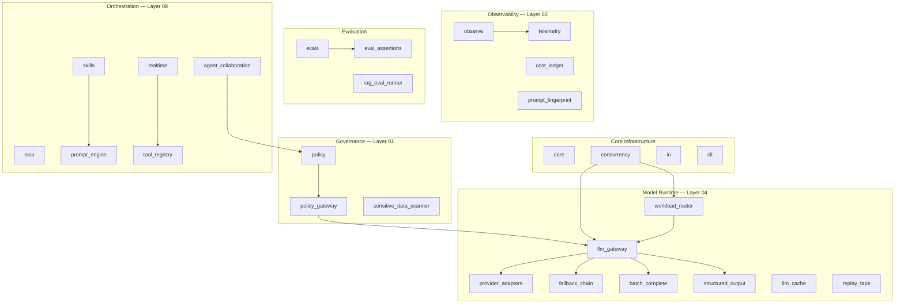

# Architecture

ElectriPy AI is organized around the [LSAS Architecture](lsas.md) — Layered Systems Architecture for AI Systems.

This page describes how ElectriPy AI's components map to the LSAS layer model and how they connect in a production system.

---

## Runtime Map

```
┌─────────────────────────────────────────────────────────┐
│  Layer 09 — Application                                 │
│  Your business logic, product surface, UX               │
├─────────────────────────────────────────────────────────┤
│  Layer 08 — Orchestration                               │
│  ai.realtime · ai.agent_collaboration · ai.skills        │
│  ai.workload_router · ai.prompt_engine                  │
├─────────────────────────────────────────────────────────┤
│  Layer 07 — Memory                                      │
│  ai.conversation_memory · ai.context_assembly           │
│  ai.token_budget                                        │
├─────────────────────────────────────────────────────────┤
│  Layer 06 — Knowledge                                   │
│  ai.rag_eval_runner · ai.rag_quality                    │
│  ai.context_assembly                                    │
├─────────────────────────────────────────────────────────┤
│  Layer 05 — Tool Integration                            │
│  ai.mcp · ai.tool_registry · ai.agent_runtime           │
├─────────────────────────────────────────────────────────┤
│  Layer 04 — Model Runtime                               │
│  ai.llm_gateway · ai.provider_adapters                  │
│  ai.structured_output · ai.llm_cache · ai.replay_tape   │
│  ai.fallback_chain · ai.batch_complete                  │
├─────────────────────────────────────────────────────────┤
│  Layer 03 — Reliability                                 │
│  concurrency.CircuitBreaker · concurrency.retry         │
│  concurrency.AsyncTokenBucketRateLimiter                │
├─────────────────────────────────────────────────────────┤
│  Layer 02 — Observability                               │
│  ai.observe · ai.telemetry · ai.cost_ledger             │
│  ai.prompt_fingerprint · ai.sensitive_data_scanner      │
├─────────────────────────────────────────────────────────┤
│  Layer 01 — Governance                                  │
│  ai.policy · ai.policy_gateway                          │
│  ai.sensitive_data_scanner                              │
└─────────────────────────────────────────────────────────┘
```

---

## Design Model

ElectriPy AI follows a **hexagonal (ports & adapters)** architecture within each module:

```
domain.py        ← frozen value objects and enums
ports.py         ← Protocol-based abstractions (interfaces)
adapters.py      ← concrete implementations
services.py      ← orchestration logic
errors.py        ← module-specific exceptions
```

This means:

- **Swap providers** without rewriting business logic.
- **Swap backends** (SQLite vs in-memory, JSONL vs OpenTelemetry) without changing calling code.
- **Test offline** by substituting fake adapters that return deterministic responses.

---

## Cross-Cutting Concerns

These concerns are addressed across multiple layers:

### Governance as a cross-cutting concern

The `ai.policy_gateway` can be wired into:
- LLM Gateway hooks (Layer 04) — inspect and sanitize model I/O
- Tool call dispatch (Layer 05) — enforce approval on destructive tools
- Agent handoffs (Layer 08) — check policy before routing messages

Use `build_llm_policy_hooks()` to attach the policy gateway to the LLM gateway:

```python
from electripy.ai.llm_gateway import LlmGatewaySettings
from electripy.ai.policy_gateway import PolicyGateway, build_llm_policy_hooks

policy = PolicyGateway(rules=[...])
request_hook, response_hook = build_llm_policy_hooks(policy)

settings = LlmGatewaySettings(
    request_hook=request_hook,
    response_hook=response_hook,
)
```

### Observability as a cross-cutting concern

The `ai.observe` tracer and `ai.telemetry` adapters emit structured events from:
- LLM calls (Layer 04)
- Policy decisions (Layer 01)
- Tool calls (Layer 05)
- Agent turns (Layer 08)
- Retrieval operations (Layer 06)

All span kinds are explicit: `LLM`, `agent`, `tool`, `retrieval`, `policy`, `MCP`.

---

## Component Dependency Graph



---

## Evaluation Pipeline

ElectriPy AI treats evaluation as a runtime concern, not a post-production audit:

```
Dataset (JSONL) → Scorer → Baseline comparison → CI gate
```

Components:
- `ai.evals` — dataset-driven scoring with pluggable scorers and baseline comparison
- `ai.eval_assertions` — pytest-native assertion helpers for output validation
- `ai.rag_eval_runner` — retrieval quality benchmarking with precision/recall/MRR

Evaluation runs before deployment. Regressions fail CI.

---

## Testing Strategy

All ElectriPy AI components are designed for offline, deterministic testing:

- **Fake adapters** — `ai.replay_tape` records real interactions and replays them without network calls
- **In-memory backends** — LLM cache, telemetry sinks, and tool registries all support in-memory operation
- **No API keys required** — the full test suite (1,000+ tests) runs offline
- **Frozen value objects** — `frozen=True` dataclasses prevent mutation-based test pollution

---

*See also: [LSAS Architecture](lsas.md)*  
*See also: [Manifesto](manifesto.md)*
