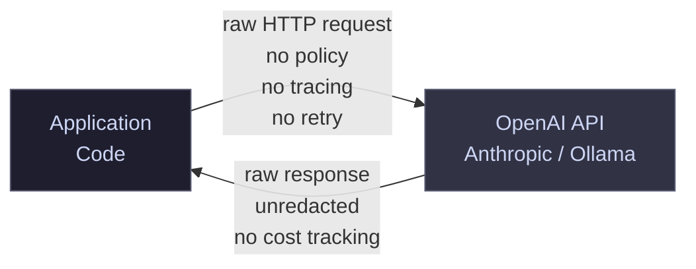
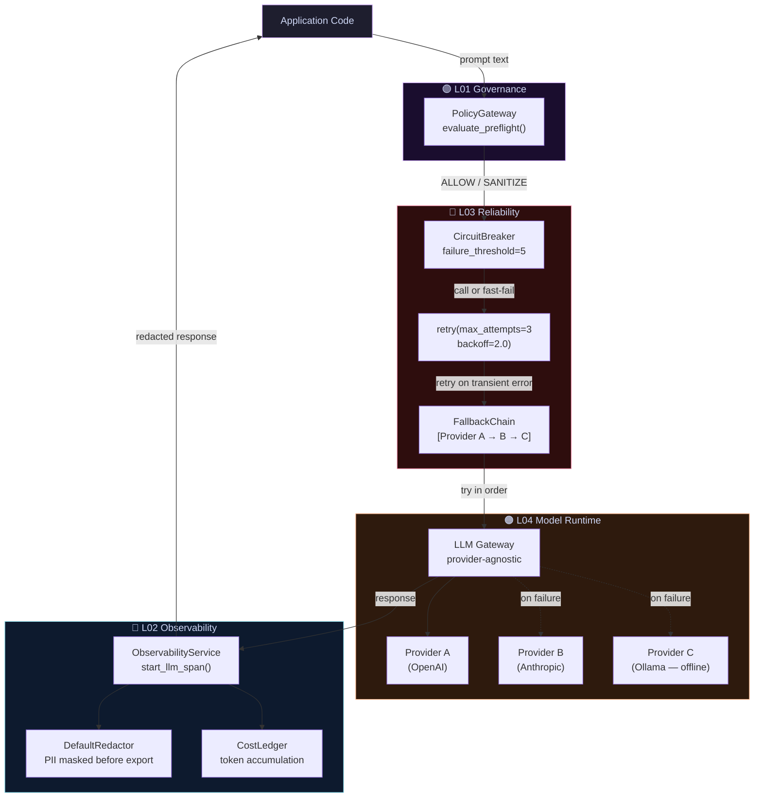

# Pattern 01 — Basic LLM Call vs. Production Gateway

A direct LLM API call is easy to write and impossible to operate.
This pattern shows what gets added between the call site and the model
once a system moves from prototype to production.

---

## ❌ Before — The Prototype Pattern

Every team starts here. It works in a notebook. It breaks in production.



**What fails in production:**

- Provider outages cause hard crashes — no retry, no fallback
- PII flows straight into logs and traces
- No circuit breaker → cascading failures under load
- No cost visibility → surprise bills
- No policy enforcement → prompt injection, data leakage
- No observability → failures discovered after users report them

---

## ✅ After — The Production Runtime Pattern

ElectriPy AI wraps the call with composable runtime layers.
Each layer is independently importable. Add what you need.



**What ElectriPy AI adds at each layer:**

| Layer | Component | Production concern addressed |
|-------|-----------|------------------------------|
| L01 Governance | `PolicyGateway` | PII sanitisation, prompt injection prevention |
| L03 Reliability | `CircuitBreaker` | Stops cascading failures from flaky providers |
| L03 Reliability | `retry` | Handles transient timeouts without crashing |
| L03 Reliability | `FallbackChainPort` | Automatic provider failover |
| L04 Model Runtime | `LLMGateway` | Provider-agnostic, swappable without rewrites |
| L02 Observability | `ObservabilityService` | Full span trace with OTEL export |
| L02 Observability | `DefaultRedactor` | PII never reaches logs or traces |
| L02 Observability | `CostLedger` | Token costs tracked per call, per tenant |

```python
# Production runtime in ~15 lines
from electripy.ai.policy_gateway import PolicyGateway, PolicyRule, PolicyStage, PolicyAction
from electripy.concurrency.circuit_breaker import CircuitBreaker
from electripy.concurrency.retry import retry
from electripy.ai.cost_ledger import CostLedger
from electripy.observability.observe import ObservabilityService, InMemoryTracer, DefaultRedactor

gateway  = PolicyGateway(rules=[...])
breaker  = CircuitBreaker(failure_threshold=5, recovery_timeout=30.0)
ledger   = CostLedger(cost_per_1k_tokens=0.010)
tracer   = InMemoryTracer(redactor=DefaultRedactor())
svc      = ObservabilityService(tracer=tracer)

decision = gateway.evaluate_preflight(user_prompt)
if not decision.blocked:
    with svc.start_llm_span(provider="openai", model="gpt-4o") as span:
        result = breaker.call(lambda: llm.complete(decision.sanitized_text or user_prompt))
        span.set_attribute("gen_ai.usage.output_tokens", result.usage.total_tokens)
        ledger.record(tokens=result.usage.total_tokens, labels={"tenant": tenant_id})
```
