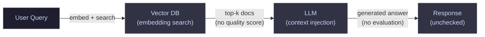
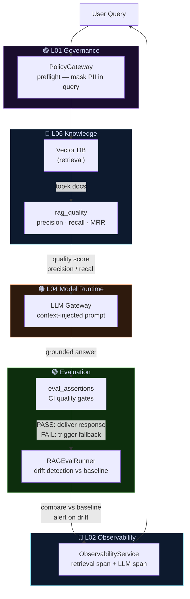

# Pattern 02 — Simple RAG vs. Production Retrieval

Basic RAG retrieves documents and calls a model. Production RAG adds
quality gates, evaluation, and fallback so regressions are caught
before users see them.

---

## ❌ Before — The Prototype RAG Pattern



**What breaks:**

- Retrieval quality degrades silently as the corpus changes
- No precision/recall tracking — you don't know when retrieval drifts
- No evaluation harness — hallucinations discovered in production
- No CI gate — bad outputs ship automatically

---

## ✅ After — The Production RAG Pattern



**Key additions:**

| Component | What it prevents |
|-----------|-----------------|
| `rag_quality` | Silent retrieval degradation — you see precision/recall drift |
| `eval_assertions` | Hallucinations shipping to users |
| `RAGEvalRunner` | Regression against a golden dataset baseline |
| `ObservabilityService` | Invisible retrieval — every doc fetch is a traced span |
| `PolicyGateway` | PII in queries reaching the vector DB or LLM logs |

```python
# Production RAG quality gate
from electripy.ai.rag_eval_runner import RAGEvalRunner
from electripy.ai.eval_assertions import assert_llm_output, contains_keywords, satisfies_length
from electripy.ai.rag_quality import compute_retrieval_metrics

# Evaluate retrieval quality against a golden query set
runner = RAGEvalRunner(queries=golden_queries, corpus=corpus)
report = runner.run()
assert report.mean_reciprocal_rank >= 0.70, f"Retrieval MRR regressed: {report.mean_reciprocal_rank}"

# Gate the generated answer before delivery
assert_llm_output(
    answer,
    checks=[
        contains_keywords(expected_keywords),
        satisfies_length(min_length=50),
    ],
)
```
