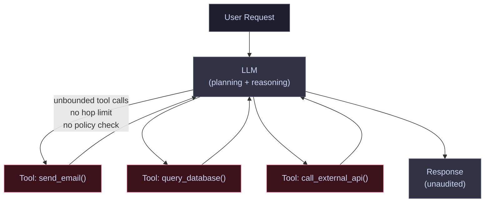
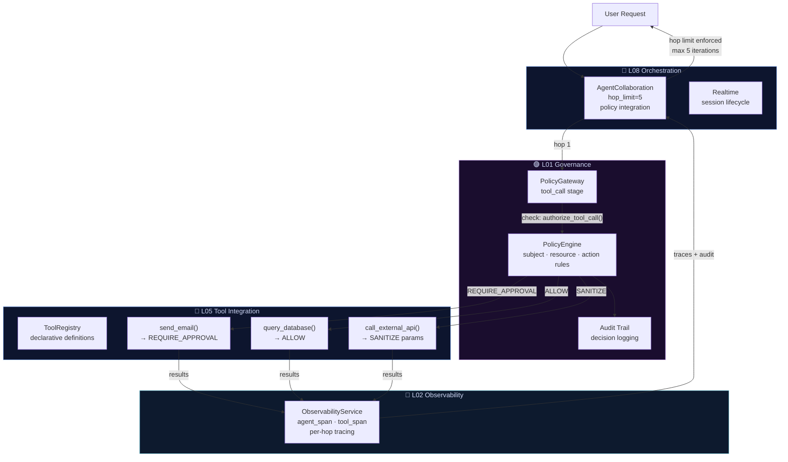

# Pattern 03 — Basic Agent vs. Governed Agent

Uncontrolled agents are the prototype trap at its worst: they work in
demos and cause incidents in production. This pattern shows how to add
governance, observability, and hop limits without changing the agent logic.

---

## ❌ Before — The Ungoverned Agent



**What fails:**

- Infinite loops — no hop limit stops recursive tool calls
- No policy on tool calls — `send_email()` fires without approval
- No audit trail — you can't explain what the agent did
- No observability — failures are opaque
- State leaks across sessions with no boundary

---

## ✅ After — The Governed Agent



**Key additions:**

| Component | What it prevents |
|-----------|-----------------|
| `AgentCollaboration` hop limit | Infinite recursion and runaway cost |
| `PolicyGateway` tool stage | Unauthorized tool invocations |
| `PolicyEngine` approval workflow | `send_email` firing without human confirmation |
| `Audit Trail` | Inability to explain agent decisions post-incident |
| `ObservabilityService` | Invisible tool calls — every hop is a traced span |
| `ToolRegistry` | Undocumented tool surfaces with no schema validation |

```python
from electripy.ai.agent_collaboration import AgentCollaborationService, CollaborationConfig
from electripy.ai.policy_gateway import PolicyGateway, PolicyStage

gateway = PolicyGateway(rules=tool_policy_rules)
svc = AgentCollaborationService(
    config=CollaborationConfig(max_hops=5, policy_gateway=gateway),
)

# Every tool call goes through the policy gateway.
# Every hop is a traced span. Hop limit enforced automatically.
result = svc.run(task=user_request, agents=[planner, executor, reviewer])
```
