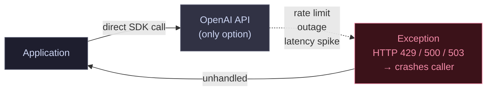
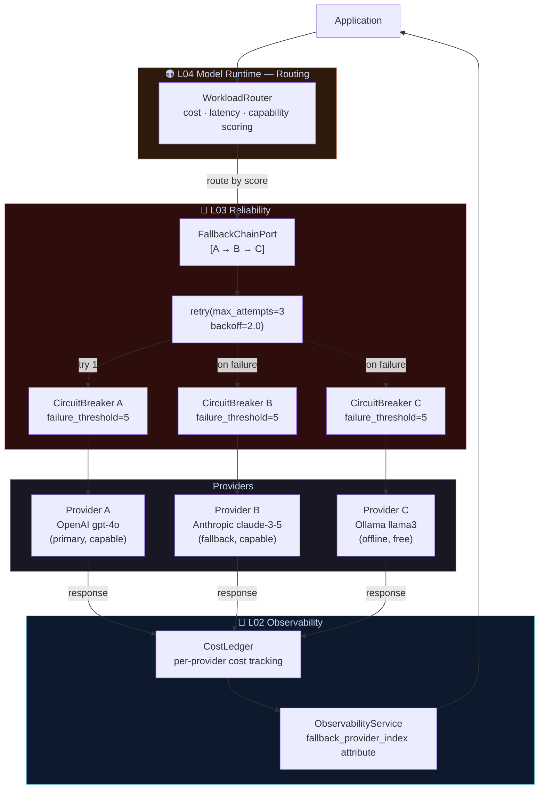

# Pattern 04 — Single Provider vs. Resilient Provider Chain

Hard-coding a single LLM provider is a single point of failure.
This pattern shows how to add multi-provider resilience with circuit
breaking, automatic failover, and cost-aware routing.

---

## ❌ Before — The Single-Provider Prototype



**What breaks:**

- Any provider outage or rate-limit kills your application
- No retry → transient errors become hard failures
- No fallback → 100% blast radius on provider degradation
- No circuit breaking → the application hammers a failing provider
- No routing → you're always paying premium pricing even for cheap tasks

---

## ✅ After — The Resilient Provider Chain



**What each layer provides:**

| Component | Failure mode addressed |
|-----------|----------------------|
| `CircuitBreaker` per provider | Stops hammering a degraded provider |
| `FallbackChainPort` | Automatic promotion to next provider on failure |
| `retry` | Transient errors (timeouts, 429s) resolved without caller awareness |
| `WorkloadRouter` | Cost-optimised routing — cheap tasks go to cheap models |
| `CostLedger` | Per-provider cost tracking to understand failover spend |
| `ObservabilityService` | `_fallback_provider_index` attribute shows which provider won |

```python
from electripy.ai.fallback_chain import FallbackChainPort
from electripy.concurrency.circuit_breaker import CircuitBreaker
from electripy.ai.cost_ledger import CostLedger

# Wrap each provider with its own circuit breaker
cb_a = CircuitBreaker(failure_threshold=5, recovery_timeout=30.0)
cb_b = CircuitBreaker(failure_threshold=5, recovery_timeout=30.0)

class ProtectedProvider:
    def __init__(self, provider, breaker):
        self._p, self._cb = provider, breaker
    def complete(self, request, *, timeout=None):
        return self._cb.call(lambda: self._p.complete(request, timeout=timeout))

chain = FallbackChainPort(providers=[
    ProtectedProvider(openai_adapter, cb_a),
    ProtectedProvider(anthropic_adapter, cb_b),
    ollama_adapter,  # no breaker — free, always available
])

response = chain.complete(request)
# response.metadata["_fallback_provider_index"] → 0 (OpenAI), 1 (Anthropic), 2 (Ollama)
```
