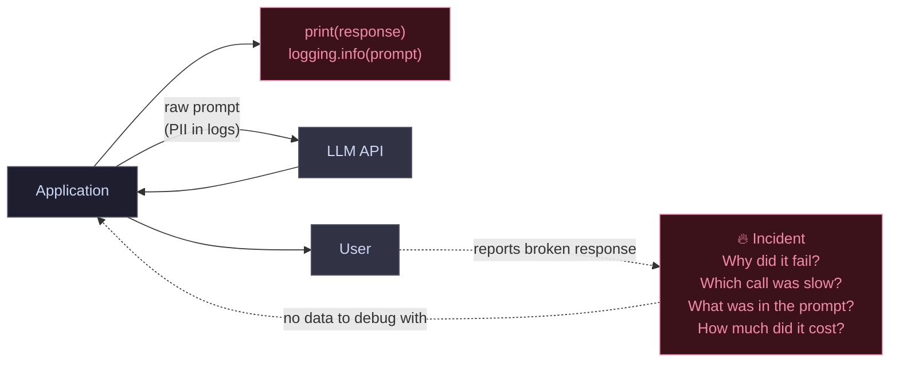
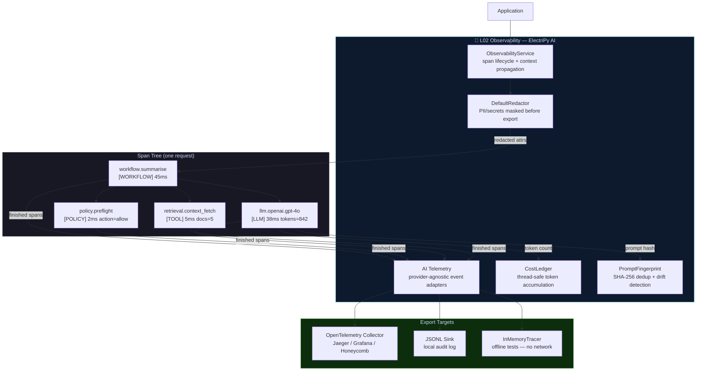

# Pattern 05 — No Observability vs. Full OTEL Stack

The difference between a prototype and a production system is often a
single question: *what happened?* Without structured observability, the
answer is always "we don't know."

---

## ❌ Before — The Invisible System



**What you lose without observability:**

- No span-level timing — can't identify slow providers or slow tools
- PII in plain-text logs — compliance violation waiting to happen
- No cost attribution — no idea which feature or tenant drives spend
- No agent hop visibility — can't reconstruct what the agent did
- No policy decision log — can't prove what was blocked and why
- No drift detection — degradation is invisible until users complain

---

## ✅ After — Full Structured Observability Stack



**ElectriPy AI observability components:**

| Component | Role |
|-----------|------|
| `ObservabilityService` | Central service — creates, parents, and closes spans |
| `InMemoryTracer` | Offline testing — captures all spans without network |
| `OpenTelemetryTracer` | OTEL export to Jaeger, Honeycomb, Grafana, etc. |
| `DefaultRedactor` | Redacts email, phone, SSN, credit card before span export |
| `AI Telemetry` | Provider-agnostic adapters for HTTP, LLM, policy, RAG events |
| `CostLedger` | Thread-safe cost accumulation — slice by model, tenant, feature |
| `PromptFingerprint` | SHA-256 request hashing for dedup, caching, and drift detection |

```python
from electripy.observability.observe import (
    ObservabilityService, InMemoryTracer, DefaultRedactor,
)
from electripy.ai.cost_ledger import CostLedger
from electripy.ai.prompt_fingerprint import hash_prompt

# Wire once at startup
tracer = InMemoryTracer(redactor=DefaultRedactor())   # swap → OpenTelemetryTracer in prod
svc    = ObservabilityService(tracer=tracer)
ledger = CostLedger(cost_per_1k_tokens=0.010)

# Every request becomes a structured, nested trace
with svc.start_workflow_span("ai.summarise") as wf:
    wf.set_attribute("workflow.request_id", request_id)

    with svc.start_span("policy.preflight", kind=SpanKind.POLICY) as pol:
        decision = gateway.evaluate_preflight(prompt)
        pol.set_attribute("policy.action", decision.action)

    with svc.start_llm_span(provider="openai", model="gpt-4o") as llm:
        # prompt attr is auto-redacted before export
        llm.set_attribute("gen_ai.system_prompt", system_prompt)
        response = provider.complete(request)
        llm.set_attribute("gen_ai.usage.output_tokens", response.usage.total_tokens)
        ledger.record(tokens=response.usage.total_tokens, labels={"tenant": tenant_id})

# All spans now in tracer.finished_spans (or exported to OTEL backend)
# PII never left the process boundary
# Cost captured and sliceable by any label
```
